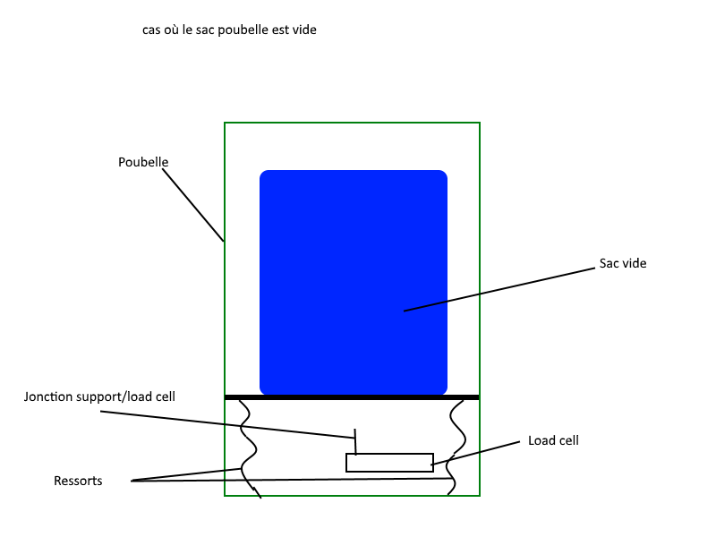
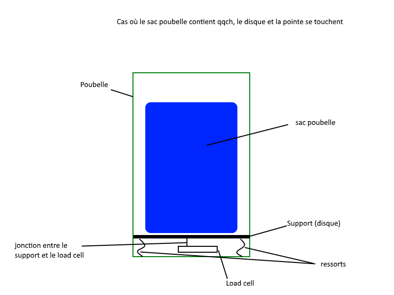

WeightSystem est un système qui nous permet de récuperer la masse d'un objet beacoup plus imposant que le load cell utilisé.

Voilà à quoi il ressemble (load cell):

L'idéal serait de poser un support en dessous du sac poubelle, le tout à l'intérieur de la poubelle. Au centre du support, sur la face opposée au sac poubelle, sera placé un petit cylindre qui permettra de concentrer toute la masse en un plus petit endroit. Ce petit cylindre sera placé sur un des bords du load cell (collé).

Le WeightSystem fonctionne de la manière suivante:

1. Lorsque le sac est vide, des ressorts maintiennent le support de façon à ce qu'il ne touche pas le petit cylindre.(fig1)
2. Dés qu'on remplit le sac, les ressorts sont comprimés, et le support commence à toucher le cylindre. L'ensemble {support+sac} va exercer une pression sur le load cell, et ainsi on pourra mesurer le poids. (fig2)

Figure 1:

Figure 2:

