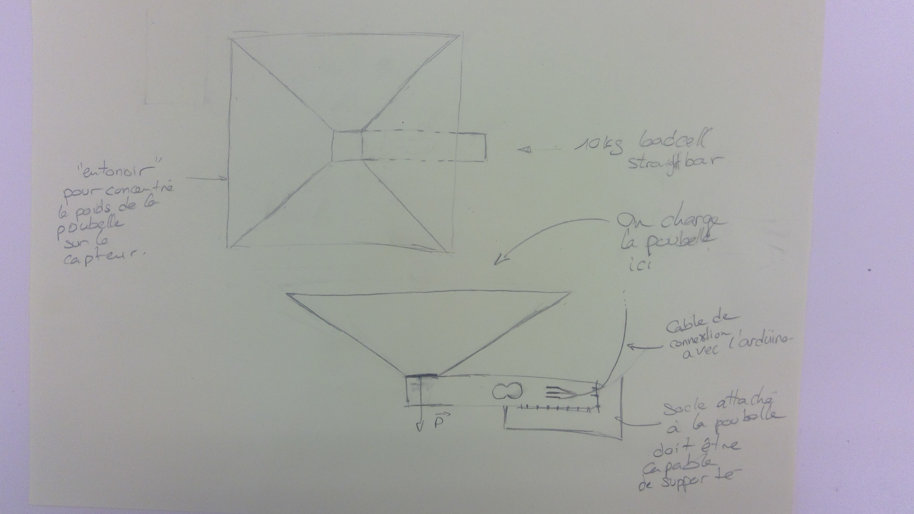

WeightSystem est un système qui nous permet de récuperer la masse d'un objet beacoup imposant que le load cell utilisé.

Le principe est très simple, on attache un "entonnoir" sur le load cell est grace a cela la masse total de l'objet dans "l'entonnoir" va être concentré sur le load cell ce qui va nous permettre d'obtenir cette valeur grace a la carte arduino.

Contrainte : Le materiau utilisé doit être assez rigide pour que le WeightSystem ne se déforme pas sous l'effet de la pression exercé par le poids de l'objet, l'inclinaison est donc tout aussi importante.
Il doit avoir un poids limité pour ne pas dépasser la masse limite accepté par le load cell.
Le bois semble être un bon compromis entre solidité et masse (les métaux étant trop lourd et le plastique étant trop peu rigide).

