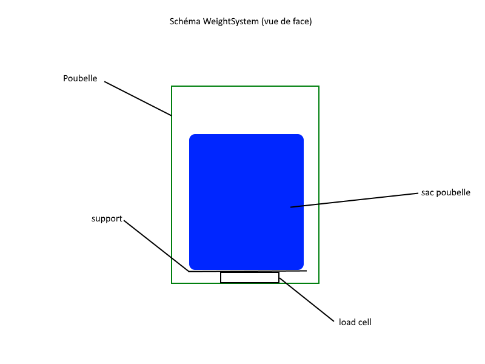

WeightSystem est un système qui nous permet de récuperer la masse d'un objet beacoup plus imposant que le load cell utilisé.

Voilà à quoi il ressemble (load cell):

Vissé sur cette cellule de pesage, on place une plaque de plexiglas qui va servir de support.

Le WeightSystem fonctionne de la manière suivante:

1. le WeightSystem, connecté à l'Arduino, prend en compte la masse du sac à vide, et "tare" pour fixer le point de mesure 0.
2. Au fur et à mesure que l'on remplit le sac, on peut mesurer sa masse.

